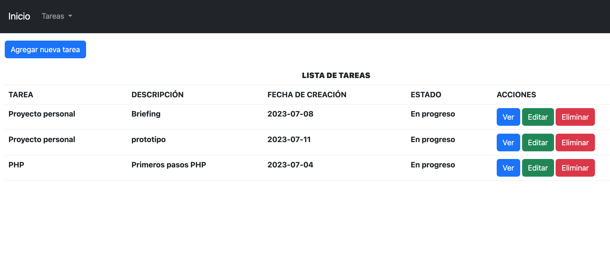

# Proyecto 6_ToDo-List con PHP y MySql
Este es un proyecto de una aplicación Todo List (lista de tareas) desarrollado utilizando PHP y MySQL. La aplicación permite a los usuarios crear, leer, editar y eliminar tareas, proporcionando una forma sencilla de organizar sus actividades diarias.

Lista de Tareas

Mostrar Tareas

Editar Tarea

## Características

- Creación de nuevas tareas con título, descripción, fecha y estado de la tarea.
- Marcado de tareas como completadas.
- Edición y actualización de tareas existentes.
- Eliminación de tareas.

## Instalación

1. Clonar el repositorio: https://github.com/MaiteNavas/P6_ToDo_List_PHP_MaiteNavas.git

2. Importar la base de datos: Todo_List.sql con phpMyAdmin.

3. Adapta las variables de conexión de DatabaseConnection:
- $host.
- $dbname.
- $user.
- $password.